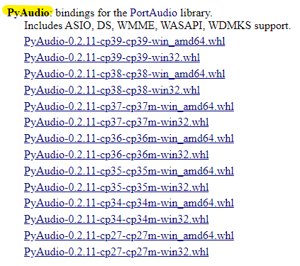

# Covid-19 tracker with voice assistant

## How to use
Run `main.py` and speak your query! <br/> Supported quiries as followings:
```
# Overall
Total cases in the world: what is the total cases
Total death in the world: what is the total death

# Country
Total cases in the country: how many cases in {COUNTRY}
Total death in the country: how many death in {COUNTRY}

# Exit
To exit: stop

# Update Database
To update: update
```
## Web Scrapping
Web scrapping using [ParseHub](https://www.parsehub.com/) API <br>
Source: [worldometer](https://www.worldometers.info/coronavirus/)

## Install dependencies
```
pip install requests
pip install pinwin32
pip install pyttsx3
pip install SpeechRecognition
pip install pyaudio
```
If you run out of failure while installing `pyaudio`, please go to [PyAudio](https://www.lfd.uci.edu/~gohlke/pythonlibs/#pyaudio) and download your pyAudio wheel based on your python version and fix the bugs.

### Check python version
Open cmd and run `python` ,  you should get similar output as below.
```
Python 3.7.6 (default, Jan  8 2020, 20:23:39) [MSC v.1916 64 bit (AMD64)] :: Anaconda, Inc. on win32
```
You should see the your installed python version and bit. In my case, mine is `Python 3.7.6` with `64 bit`

### Download PyAudio.whl
Download based on your python verison and bit.

```
PyAudio-{PYAUDIO_VERSION}-cp{PYTHON_VERSION}-win{PYTHON_BIT}.whl
```


Open cmd and change the directory to the folder that contain the .whl file.
Run:
```
pip install {YOUR_PYAUDIO_FILENAME}
```

## References
[Python Project - Coronavirus Web Scraper & Voice Assistant Tutorial](https://www.youtube.com/watch?v=gJY8D468Jv0)

## Troubleshoot

1. The time for updating the database is **too slow**.
2. The function is **too simple**.
3. The `pyttsx3 speak()` **didn't work**.

